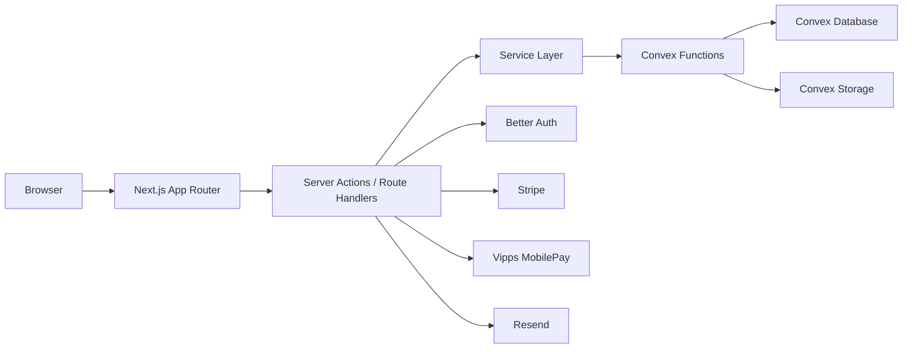

# System Architecture

## Chosen stack

- `Next.js` for UI, routing, backend middle layer, and public endpoints
- `Convex` for database, internal business logic, jobs, and storage metadata
- `Better Auth` for authentication, sessions, invitations, and organization admin access
- `Resend` for transactional email delivery
- `Convex Storage` for logos and uploaded assets
- `Stripe` for card payments and subscriptions
- `Vipps MobilePay` for one-time and recurring mobile payments
- `Zod` for input validation and contract shaping
- `Vitest` for unit and service tests
- `Playwright` for end-to-end and regression testing

## Architectural principles

- the browser never talks to Convex directly
- `Next.js` is the public application boundary
- all payment secrets and provider orchestration stay server-side
- business data is tenant-scoped by organization
- type safety is preserved across the stack through TypeScript, shared schemas, and typed service functions
- external providers are normalized into internal domain models

## High-level flow



## Responsibility split

### Next.js

`Next.js` owns:

- all UI rendering
- public signup pages
- organization admin dashboard
- member self-service pages
- route handlers for public APIs and webhooks
- server actions for authenticated app mutations
- request authentication and authorization checks
- rate limiting and abuse protection later
- mapping request data into typed service calls

### Convex

`Convex` owns:

- tenant-scoped application data
- internal queries, mutations, and actions
- background jobs and scheduled work
- storage references and file metadata
- normalized records for payments, memberships, activity, and automations

Convex is treated as an internal application service, not a browser-facing API.

### Better Auth

`Better Auth` owns:

- sign-in and sign-out
- sessions
- invitation flows
- admin identity lifecycle

Authorization still belongs to the app. Session identity is not enough on its own; all access to organization data must be checked against organization membership and role.

### Resend

`Resend` owns:

- outbound transactional email delivery
- delivery webhooks if enabled later

Message content, event triggering, and delivery history remain in the app.

### Stripe and MobilePay

Payment providers own:

- payment authorization
- recurring billing agreements
- provider-side payment state
- webhooks

The platform owns:

- internal billing abstraction
- payment status normalization
- membership activation rules
- CRM activity creation
- automation triggering

## Full-stack type safety without tRPC

We are intentionally not using `tRPC`.

Type safety will come from:

- TypeScript across the repo
- `Zod` schemas for form inputs and external payloads
- typed `Next.js` server actions and route handlers
- typed service-layer functions
- typed Convex schema and function arguments

This gives us full-stack type safety while keeping a strict backend boundary between the browser and Convex.

## Data flow model

### Read flow

1. request hits a `Next.js` page or layout
2. server component validates the current session
3. server component calls a server-side service function
4. service function calls Convex query helpers
5. typed result is returned to the component

### Write flow

1. user submits a form
2. `React Hook Form` and `Zod` validate client-side
3. submission reaches a server action or route handler
4. server re-validates with shared `Zod` schema
5. service function applies auth and business rules
6. service function calls Convex mutation or action
7. response revalidates the relevant route segments

### Webhook flow

1. external provider sends webhook to `Next.js` route handler
2. signature is verified
3. payload is validated and normalized
4. service function writes canonical event data to Convex
5. Convex updates billing/member state and activity timeline
6. automations are queued if needed

## State management rules

### Server state

Default source of truth:

- `Next.js` server components
- server-side service calls

Use for:

- member lists
- payment history
- organization settings
- dashboards
- public page configuration

Do not mirror this data into a large client-side global store.

### Mutation state

Default mutation path:

- `Server Actions` for authenticated application behavior

Use `Route Handlers` for:

- public form submissions from external sites
- webhooks
- auth callbacks
- future public API endpoints

### Client UI state

Use `Zustand` only for lightweight client state:

- modal visibility
- stepper progress
- panel expansion
- bulk row selection
- transient UI preferences

Do not use `Zustand` as the main data-fetching cache.

### Form state

Use:

- `React Hook Form`
- `Zod`

Use for:

- signup flows
- organization settings
- plan configuration
- member editing

### URL state

Use URL params for:

- search
- filters
- pagination
- tab selection
- sort order

This keeps the dashboard shareable and refresh-safe.

## Folder structure

```text
src/
  app/
    (dashboard)/
    (public)/
    api/
  actions/
  components/
  lib/
    config/
    server/
      auth/
      convex/
      payments/
      services/
    validations/
  stores/
convex/
docs/
```

## Backend boundary conventions

### Rule 1

No browser component imports Convex client packages directly.

### Rule 2

All business operations go through a service layer in `src/lib/server/services`.

### Rule 3

All external payloads are validated before they touch business logic.

### Rule 4

Payment providers are wrapped behind internal modules so the rest of the app talks in platform concepts like `membership`, `subscription`, and `payment`.

### Rule 5

All tenant-aware operations require an organization id and role check.

## Security model

- sessions are established with `Better Auth`
- organization membership and role checks happen in the app layer
- payment secrets remain only in server runtime
- webhook signatures are verified before processing
- public form submissions are re-validated server-side
- audit logs are stored for admin mutations

## Multi-tenant model

The platform is a single application serving many organizations.

Each organization has:

- branding
- admins
- plans
- forms
- members
- contacts
- payment connections
- templates
- automation history

Every business table is scoped by `organization_id`.

## Payment integration model

Use one internal billing model for both providers.

Core internal concepts:

- `payment_account`
- `membership_plan`
- `member`
- `subscription`
- `payment`
- `activity_event`

The rest of the app must not care whether a payment came from Stripe or MobilePay.

## Email model

Email automations are event-based, not workflow-builder-based.

Core triggers:

- member created
- payment succeeded
- payment failed
- renewal upcoming
- subscription canceled

Core actions in v1:

- send member email
- send admin notification
- log automation outcome

## Testing strategy

### Vitest

Use for:

- validation schemas
- service-layer business rules
- payment normalization helpers
- permission checks

### Playwright

Use for:

- signup journey
- checkout redirects and success states
- admin flows
- member portal flows
- embed or hosted page smoke tests

## Decisions deferred

- error tracking provider
- exact rate limiting layer
- background job retry policy details
- whether MobilePay launches in phase 1 or phase 2
- whether client organizations always connect their own payment accounts

## Implementation starting point

The first implementation slice should be:

1. app shell and folder structure
2. Better Auth session setup
3. organization and admin tenant model
4. Convex schema for organizations, plans, people, and members
5. hosted signup form flow
6. Stripe first, then MobilePay
